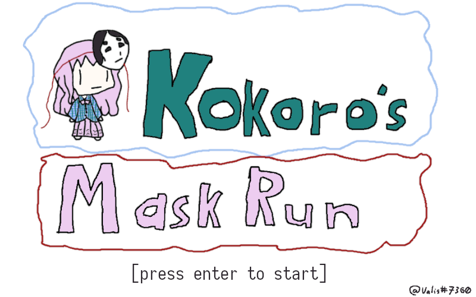

# kokoros-mask-run

Entry for Touhou Game Jam 4

As of pretty much now, the jam is over, so here's the [Submission page](https://itch.io/jam/touhou-jam-4/rate/441673).

Hata no Kokoro has lost _all_ of her masks, now she has to run through Gensokyo to retrieve them!

## tl;dr

Basic infinite runner game, loads in premade segments as the player goes.
Only controls should be jump and crouch, the rest just goes by.
As the "plot" might entail, you have to collect Kokoro's masks in order to restore her "**identity**", a theme for this jam.
Definitely not a stretch :P.

## Primary Goals

* [X] shitty art
* [X] tight controls
* [X] arcade esque
* [X] repeatable and _fun_
